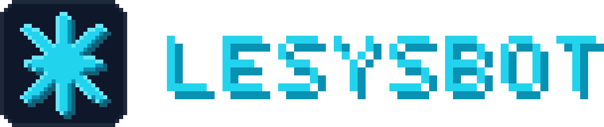
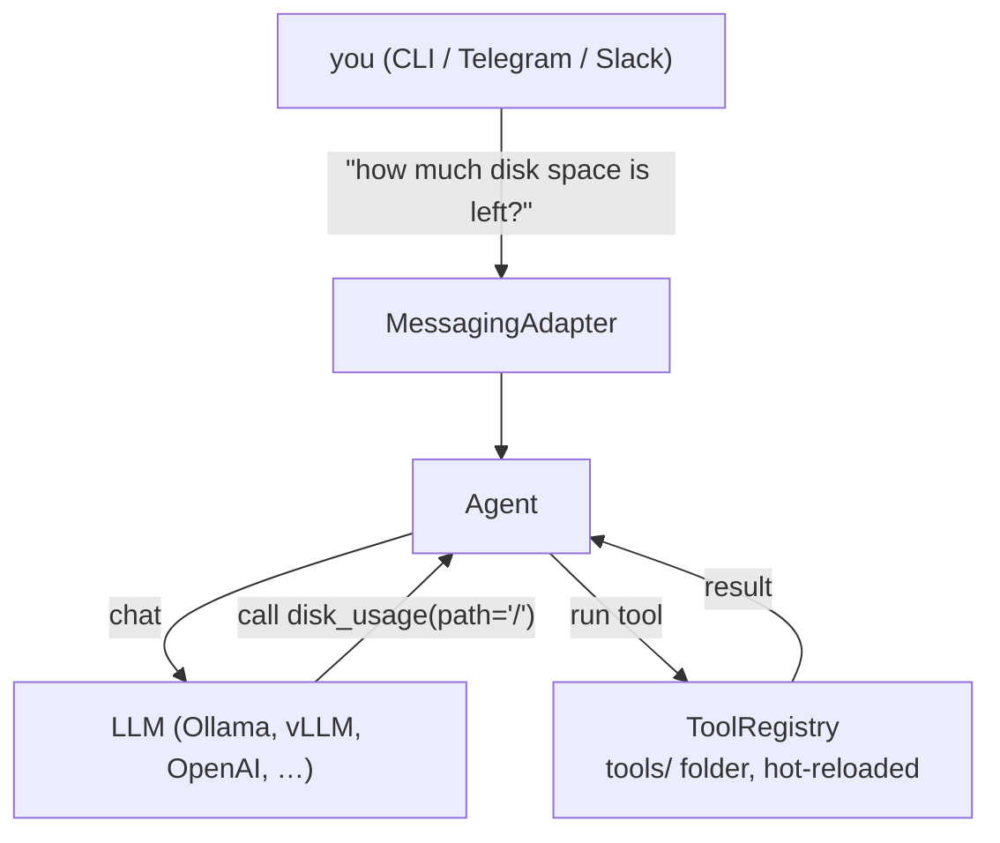

**Chat with your own machine.** Ask it a question in plain language — from your
terminal, from Telegram on your phone, or from Slack — and it answers, using
tools that can read and control that machine.

```
You: how hot is it running right now?
Bot: CPU 41–47 °C across 16 cores, GPU 38 °C. Nothing to worry about.

You: how much space is left on /?
Bot: 45 GB free out of 200 GB — 78% used.

You: reboot it
Bot: ⚠ This will reboot the machine in 1 minute. Proceed? [y/n]
```

The language model runs **locally** on your hardware with
[Ollama](https://ollama.com), so your messages and everything the tools report
stay with you. No account, no cloud service, nothing to sign up for.

[**Docs & guides → lesysbot.github.io**](https://lesysbot.github.io)

---

## Why you might want this

- **Reach your machine when you're not at it.** A home server, a work desktop, a
  render box — message it from your phone and get a real answer.
- **Ask instead of remembering.** "Is the disk filling up?" beats
  `df -h | grep -v tmpfs`.
- **Teach it new tricks.** A tool is a folder with a small Python file in it.
  Drop it in and it works — no restart, no registration, no plugin API to learn.
- **Watch the machine over time.** Installing LeSysBot also sets up a
  [Grafana dashboard](monitoring/README.md) of CPU, memory, disk, network and
  GPU (running at http://localhost:3000) — and the bot can share a snapshot of
  it as a link.
- **It asks first.** Anything drastic (reboot, power off) waits for your yes.

---

## Get started

**You need:** Python 3.11+ and a model runner — [Ollama](https://ollama.com) is
the easy one (you can point it at OpenAI instead, in the wizard).

**1. Get a model running**

```bash
# install Ollama — https://ollama.com/download has Linux, macOS and Windows
ollama pull qwen3.5:4b
```

**2. Install LeSysBot**

```bash
git clone https://github.com/lesysbot/lesysbot
cd lesysbot

bash scripts/install.sh      # Linux & macOS
.\scripts\install.ps1        # Windows (PowerShell)
```

A short wizard asks a few questions. **Press Enter through all of them** and you
get a working local bot. Nothing is written to disk until you pick **Apply**;
your settings land in `~/.lesysbot/config.yaml`.

**3. Say hello**

```bash
lesysbot --provider cli
```

```
You: what operating system is this?
Bot: Linux 6.8.0 on x86_64.

You: /help
      …lists every tool it can run
```

**4. Open the control panel** at **http://127.0.0.1:8700** — settings, tools and
health in a browser. The background service keeps it online; `lesysbot` on its
own prints the same health summary in your terminal.

That's it. The full walkthrough — including how to reach it from Telegram or
Slack — is in **[Getting started](docs/getting-started.md)**, or on the docs
site at **<https://lesysbot.github.io/latest/guides/getting-started/>**.

---

## What next?

| I want to… | Go to |
|---|---|
| Use it day to day | [Everyday use](docs/usage.md) |
| Message it from my phone | [Telegram & Slack](docs/adapters.md) |
| Give it a new ability | [Write a tool](docs/writing-tools.md) |
| Install tools other people wrote | [Install tools](docs/installing-tools.md) |
| Manage it from a browser | [Control panel](docs/management-ui.md) |
| Keep it running in the background | [Run as a service](docs/service.md) |
| Graph my machine's health | [System monitoring](monitoring/README.md) |
| Fix something that's broken | [Troubleshooting](docs/troubleshooting.md) |

Full index: **[docs/README.md](docs/README.md)**.

---

## Adding abilities

Everything LeSysBot can *do* comes from tools, and a tool is just a folder:

```python
# ~/.lesysbot/tools/hello/tool.py
from lesysbot.mcp import tool

@tool(description="Say hello to someone")
async def hello(name: str) -> str:
    return f"Hello, {name}!"
```

Save the file and it's live — usable as `/hello name=Ada` **and** by the model
when you say "say hi to Ada". Guide: [Writing tools](docs/writing-tools.md).

Ready-made collections for your OS:

```bash
lesysbot tools install lesysbot/lesysbot-linux-tools-official     # ping, DNS, traceroute, temps
lesysbot tools install lesysbot/lesysbot-macos-tools-official     # battery, temps
lesysbot tools install lesysbot/lesysbot-windows-tools-official   # ping, tracert, temps
```

---

<details>
<summary><b>Under the hood — how a message becomes an answer</b></summary>

Three layers that barely know about each other, wired together by one `Agent`:



Because the layers are independent, each kind of change is small and local: a
new chat platform is one adapter file, a new model backend is a different
`base_url`, and a new ability is a folder in `tools/`.

The full walkthrough — startup, the tool-calling loop, discovery, gating,
logging — is in **[How it works](docs/architecture.md)**.

</details>

<details>
<summary><b>Everything it can do (full feature list)</b></summary>

- **Local models by default** — Ollama, vLLM, LlamaCpp; or point it at OpenAI
- **Three ways to chat** — terminal, Telegram, Slack
- **Tools as folders** — drop one in `tools/`, it's live without a restart
- **Install tools from GitHub** — `lesysbot tools install owner/repo`, no
  registry involved
- **Call tools without the model** — `/tool_name args` runs directly, and works
  even when no model is running
- **Cross-platform aware** — tools declare which OSes and binaries they need and
  explain themselves instead of failing
- **Confirmation prompts** — destructive tools wait for your approval
- **Terminal tool management** — `lesysbot tools list/enable/disable/remove`,
  applied to a running bot within a second
- **Always-on local control panel** — the service serves a
  [localhost-only UI](docs/management-ui.md) for config, tools and health at
  `http://127.0.0.1:8700`
- **Boot notification** — a Telegram/Slack bot pings you with a system report
  when the machine comes up
- **Prometheus + Grafana stack** — set up by the installer on all three OSes,
  plus `share_dashboard` to publish an expiring public snapshot link
- **Structured traces** — every request logged to `logs/traces.jsonl`
- **Secrets redacted** — tokens never reach a log file

</details>

<details>
<summary><b>Using an AI agent to set this up?</b></summary>

Point it at the self-contained skills in **[skills/](skills/README.md)** — one
per job (install, configure, switch backends, manage tools, write a tool,
troubleshoot). They're written for agents, so it won't need these docs or the
source code.

</details>

---

## Contributing

Most contributions don't touch the core. **A new tool** is a folder in `tools/`
— or your own repo, which people install with `lesysbot tools install you/repo`,
no pull request needed. **A new chat platform** is one adapter file plus one
`elif`. **Core fixes** come with a test. Setup, checks, and per-change
checklists are in [CONTRIBUTING.md](CONTRIBUTING.md).

Want a feature, or want to help? Message me —
[LinkedIn](https://www.linkedin.com/in/syandev/) ·
[syan.vn@gmail.com](mailto:syan.vn@gmail.com)

## License

MIT
