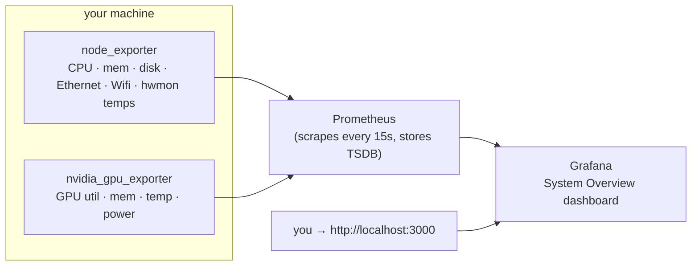

# System Overview — Prometheus + Grafana

The dashboard stack that records your machine's **CPU, memory, disk,
network (Ethernet & Wifi) and GPU** as time series and shows them on a
ready-made Grafana dashboard.

**This ships as a standard part of LeSysBot, not an add-on.** `lesysbot setup`
(run by the installer) seeds this stack into `~/.lesysbot/dashboard` and starts
it for you, so a normal install leaves Grafana running at
**http://localhost:3000**. It runs as containers on the host network and needs
Docker Engine + Compose v2.

If Docker isn't ready at install time, setup prints the one command that
finishes the job. The steps here are for starting/stopping and reconfiguring it
by hand.

It is **separate from LeSysBot itself** — it runs as its own processes, and
LeSysBot's only listener is its localhost management panel. Everything this stack
exposes is bound to **`127.0.0.1` only** (nothing on your LAN) and needs **no
sudo/admin**.



- **Prometheus** scrapes the exporters every 15 s and stores the time series.
- **Grafana** auto-loads the datasource and the dashboards — no manual import.
- **Exporters** are the standard Prometheus ones (`node_exporter`,
  `nvidia_gpu_exporter`); nothing custom to trust.

---

## Prerequisites (once)

### Docker with Compose v2

Check whether you already have it:

```bash
docker compose version      # should print "Docker Compose version v2.x"
```

If that fails, install [Docker Engine](https://docs.docker.com/engine/install/)
for your distro, then add yourself to the group so it runs without sudo:

```bash
sudo usermod -aG docker $USER      # then log back in
```

[Docker Desktop for Linux](https://docs.docker.com/desktop/install/linux-install/)
works too.

That's the whole install. Everything else below downloads automatically the
first time you start the stack — **no manual Prometheus/Grafana/exporter setup,
no config to write.**

### Get the files

This stack lives in the LeSysBot repo. If you installed LeSysBot with `pip` (so
you don't have a checkout), grab it with:

```bash
git clone https://github.com/lesysbot/lesysbot
cd lesysbot/dashboard
```

The `dashboard/` folder is self-contained — copying just it is enough.

---

## Quick start

Open a terminal in this `dashboard/` folder and run:

```bash
cd dashboard
./scripts/start.sh          # detects your NVIDIA GPU automatically
```

Everything (Prometheus, Grafana and the exporters) runs on the host network,
bound to localhost. Open **http://localhost:3000** — login `admin` / `admin`.

`start.sh` adapts automatically:

- **No NVIDIA GPU** → starts CPU/memory/disk/network only.
- **NVIDIA GPU + [nvidia-container-toolkit](https://docs.nvidia.com/datacenter/cloud-native/container-toolkit/latest/install-guide.html)**
  → GPU metrics run as a container (`--profile gpu`).
- **NVIDIA GPU, no toolkit** → GPU metrics run as a small **native** exporter
  instead — no toolkit needed, still works.

You don't choose; the script detects `nvidia-smi` and the Docker NVIDIA runtime
for you.

### Stop it

```bash
./scripts/start.sh down
```

---

## What you get

**One dashboard** lands in the **LeSysBot** folder in Grafana: **System Overview
— Linux**, fed by `node_exporter` (plus `nvidia_gpu_exporter` when you have an
NVIDIA card).

### The dashboard is built for your machine

`start.sh` **probes the host first** and asks `gen-dashboards.py` for a dashboard
containing only panels something can fill. The reason is simple: a panel querying
a sensor your hardware doesn't have renders exactly like a broken panel, and you
can't tell them apart by looking. After this, an empty panel means a real fault
worth chasing.

| Probed | How |
|---|---|
| CPU / disk / AMD-GPU temperature sensors | chip names in `/sys/class/hwmon/*/name` |
| ACPI thermal zones | `/sys/class/thermal/thermal_zone0` |
| NVIDIA | `nvidia-smi` on `PATH` |

NVIDIA is keyed on `nvidia-smi` rather than on the card, because
`nvidia_gpu_exporter` works by shelling out to it — a GPU with no driver can't be
scraped by anything. When the hardware is there but the tool isn't, the script
says so and tells you what to install instead of quietly dropping the row.

The script also prints **optional add-ons** at the end — things that would fill
in more panels, like a `modprobe` for a missing sensor driver. They're
suggestions, never errors, and never run for you.

The committed portable dashboard (`system-overview.json`) remains the fallback:
you get it when the host has no `python3`, or when you run `docker compose` by
hand. It asks for every sensor family, so panels your machine can't fill show up
empty — which is exactly the ambiguity the probe removes.

It shows these categories:

- **CPU** — busy %, per-mode usage, load average, core count
- **Memory** — used / cached / available, swap
- **Disk** — filesystem used % per mount, read/write throughput
- **Network** — receive/transmit **per interface**; the interface name tells
  Ethernet from Wifi (`eno1`/`eth0` vs `wlp*`/`wlan0`)
- **Temperatures** — CPU (package + per-core), disk (NVMe/SATA), GPU, and other
  sensors (ACPI zone, chipset, Wifi radio). See the caveats below.
- **GPU (NVIDIA)** — utilization, memory used, temperature, power draw

Use the **Host** dropdown at the top to filter when more than one machine reports.

The portable dashboard asks for **every** sensor family a Linux box might have,
so a machine missing one leaves that panel empty. The probed cut `start.sh`
generates is the same dashboard with those panels left out — see
[above](#the-dashboard-is-built-for-your-machine).

### Temperature sensor coverage

The exporters only surface what the kernel exposes, and no sudo is used:

| Sensor | Source |
|---|---|
| **CPU** (package + cores) | `coretemp` (Intel) / `k10temp` (AMD) / `cpu_thermal` (ARM) hwmon chips |
| **Disk** (NVMe/SATA) | `nvme` / `drivetemp` hwmon chips |
| **GPU** (NVIDIA) | `nvidia_gpu_exporter` → `nvidia-smi` |
| **GPU** (AMD) | `amdgpu` hwmon chip — no exporter needed |
| **ACPI / chipset / Wifi radio** | `/sys/class/thermal` zones |

All of it comes through `node_exporter`'s `hwmon`/`thermal_zone` collectors,
except the NVIDIA row. `start.sh` checks which chips are bound and **tells you
the exact `modprobe`** for the ones that are missing (`coretemp`/`k10temp` for
CPU, `drivetemp` for SATA disks; NVMe needs nothing). It skips that advice inside
a VM, where there are no sensors to expose.

---

## Share a snapshot from chat

If you also run the bot, the [`share-dashboard`](../tools/share-dashboard/) tool
turns *"share me the dashboard"* into a public link. It publishes a point-in-time
**snapshot** — the current graphs baked in as data — *through Grafana* to its
public snapshot server (`snapshots.raintank.io`), so you can send someone a
live-looking view without exposing your Grafana:

```
You:  share me the dashboard for a day
Bot:  📊 Dashboard shared — expires in 1d:
      https://snapshots.raintank.io/dashboard/snapshot/…
```

Pick an expiration (`1h`…`30d` or `never`), list your shares (*"list my shared
dashboards"* — this reads Grafana's own snapshot registry), and delete any of them
(*"delete snapshot 1"* — removed from Grafana **and** raintank). Because a snapshot
is a **public** link to a copy of your metrics, share deliberately and delete what
you no longer need. Two caveats: raintank may keep serving a *cached* copy for up
to ~1h after you delete, and a snapshot you publish from Grafana's own browser
button (rather than through the bot) can't be deleted by the tool — share through
the bot to keep it cleanable. The tool **finds Grafana automatically** (it probes
the `GRAFANA_PORT` from `.env` first, then the usual 3000/3001, and checks each
answers as Grafana), so it works even if the stack landed on 3001 because 3000 was
taken; set `LESYSBOT_GRAFANA_URL` only if Grafana runs somewhere unusual — and
even then it's verified, falling back to probing if nothing answers there. Full details: [`tools/share-dashboard/README.md`](../tools/share-dashboard/README.md).

---

## Ports & security

Everything binds to loopback; nothing is reachable from your network.

| Service | Address | Notes |
|---|---|---|
| Grafana | `127.0.0.1:3000` | login `admin` / `admin` — **change it** in `.env` |
| Prometheus | `127.0.0.1:9090` | `/targets` shows exporter health |
| node_exporter | `127.0.0.1:9100` | host metrics |
| nvidia_gpu_exporter | `127.0.0.1:9835` | GPU metrics |

**Change the Grafana password** before exposing it anywhere: copy `.env.example`
to `.env` and set `GRAFANA_ADMIN_PASSWORD`. If you deliberately publish Grafana,
put it behind a reverse proxy with TLS — don't move the bind off `127.0.0.1`
without one.

---

## Configuration

Copy `.env.example` → `.env` (git-ignored) to override:

```ini
GRAFANA_ADMIN_USER=admin
GRAFANA_ADMIN_PASSWORD=change-me
PROM_RETENTION=15d        # how long Prometheus keeps data
GRAFANA_PORT=3000         # change if 3000 is taken
PROM_PORT=9090            # change if 9090 is taken
```

`GRAFANA_PORT` is the single place the port is set: LeSysBot reads it back when it
looks for Grafana, so a stack moved to 3001 is still found by the status screen and
by *"share me the dashboard"* — no extra configuration.

- **Add another machine or exporter:** add its `host:port` to the relevant job in
  `prometheus/prometheus.yml`, then `curl -X POST http://localhost:9090/-/reload`.
- **Longer history:** raise `PROM_RETENTION` (data lives in the
  `prometheus-data` Docker volume).

---

## Editing the dashboards

The two JSON files under `grafana/dashboards/` are generated — the source of
truth is [`scripts/gen-dashboards.py`](scripts/gen-dashboards.py). Change a panel
there and regenerate so both dashboards stay consistent:

```bash
python3 scripts/gen-dashboards.py     # stdlib only, no deps
```

Grafana reloads provisioned dashboards within 30 s. You can also edit live in the
Grafana UI to experiment; re-run the generator to make a change permanent.

---

## Troubleshooting

**A target is `down` on http://localhost:9090/targets.** That's normal for the
ones you're not running — `nvidia_gpu` is down without an NVIDIA card, and the
native `node` target is down when you use the containerised one (and vice-versa).

**GPU row is empty.** You have no NVIDIA card, or `nvidia-smi` isn't on `PATH`,
or you started without `--profile gpu` and didn't run the native GPU exporter.
Without the nvidia-container-toolkit, use the native fallback shown in *Quick
start*.

**No Temperatures row at all.** The host has no hwmon chips and no ACPI
thermal zones, so the row was left out on purpose. Inside a VM that's the end of
it — the hypervisor exposes no sensors. On bare metal `start.sh` prints the
`modprobe` to load the missing driver; run it, then re-run `start.sh` so the
dashboard is rebuilt with the panel. Check what the kernel sees with:

```bash
cat /sys/class/hwmon/*/name
```

**Grafana won't start / "address already in use".** Something else holds 3000
(or 9090). Set `GRAFANA_PORT` / `PROM_PORT` in `.env` and start again.

Port 9090 in particular is popular — VS Code, among others, listens there.
Changing `PROM_PORT` is safe: nothing links to Prometheus directly, and the
Grafana datasource is regenerated from that value on every run. `GRAFANA_PORT` is
the one that's visible — LeSysBot derives the URL it saves from it, so changing
it moves the link on the status screen too.

**The dashboard is there but every panel is empty.** Grafana is up and
Prometheus isn't — check `docker compose ps` and the Prometheus container's logs.

**Metrics missing even though a native exporter is running.** Containers can't
reach a host port when `ufw`/firewall blocks the Docker bridge — that's exactly
why this stack runs on the **host network** instead. Use `./scripts/start.sh`
rather than rolling your own bridge network.

**Don't mix paths.** Running both the containerised GPU exporter (`--profile
gpu`) and the native one (`run-exporters.sh`) fights over port 9835. Pick one.

**Reset everything (including stored history):**
```bash
docker compose --profile gpu down -v      # -v also wipes the stored history
```

---

## Files

```
dashboard/
├── docker-compose.yml            # the stack (host network, localhost-bound)
├── .env.example                  # ports, retention, Grafana login
├── prometheus/
│   └── prometheus.yml            # scrape config
├── grafana/
│   ├── provisioning/             # datasource + dashboard auto-load (Docker paths)
│   ├── dashboards/system-overview.json   # generated (see gen-dashboards.py)
│   ├── dashboards/generated-*.json       # per-host cuts from start.sh, git-ignored
│   └── dashboards/generated/     # rendered dashboard packages, git-ignored
└── scripts/
    ├── start.sh                  # one-command start/stop, probes the host
    ├── run-exporters.sh          # native host exporters (GPU fallback)
    └── gen-dashboards.py         # regenerate the dashboard (also --host, per host)
```

The provisioned dashboard is generated for the host rather than copied from
`grafana/dashboards/`:

```bash
python3 scripts/gen-dashboards.py     # the committed, portable JSON

python3 scripts/gen-dashboards.py --host linux --have cpu_temp,disk_temp,nvidia --out FILE
```

Every `--have` capability is something the caller **verified**, and an unknown
one is a usage error rather than a silently missing row. Generated files are
`grafana/dashboards/generated-*.json` and git-ignored — they describe one
machine.

`gen-dashboards.py` stays the single source of truth either way — **never
hand-edit the JSON**. Generating per host is what keeps that true without
committing a file for every hardware combination.
