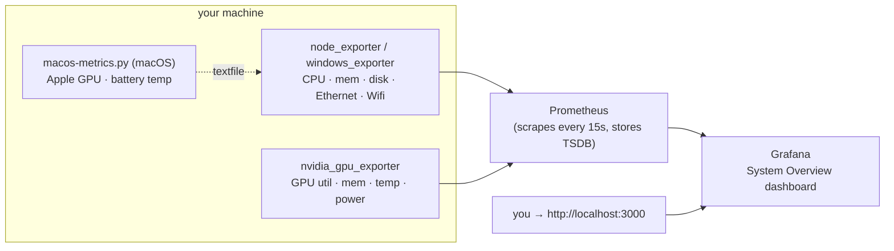

# System Overview — Prometheus + Grafana

The dashboard stack that records your machine's **CPU, memory, disk,
network (Ethernet & Wifi) and GPU** as time series and shows them on a
ready-made Grafana dashboard. Runs on **Linux, macOS and Windows**.

**This ships as a standard part of LeSysBot, not an add-on.** `lesysbot setup`
(run by the installer) seeds this stack into `~/.lesysbot/dashboard` and starts
it for you, so a normal install leaves Grafana running at
**http://localhost:3000**. What it needs depends on your OS:

| OS | How it runs | Needs |
|---|---|---|
| **macOS** | natively, under `brew services` | [Homebrew](https://brew.sh) — **no Docker Desktop** |
| **Linux** | containers on the host network | Docker Engine + Compose v2 |
| **Windows** | containers + native exporter | Docker Desktop, or a native Grafana by hand |

If the prerequisite isn't ready at install time, setup prints the one command
that finishes the job. The steps here are for starting/stopping and
reconfiguring it by hand.

It is **separate from LeSysBot itself** — it runs as its own processes, and
LeSysBot's only listener is its localhost management panel. Everything this stack
exposes is bound to **`127.0.0.1` only** (nothing on your LAN) and needs **no
sudo/admin**.



- **Prometheus** scrapes the exporters every 15 s and stores the time series.
- **Grafana** auto-loads the datasource and the dashboards — no manual import.
- **Exporters** are the standard Prometheus ones (`node_exporter`,
  `windows_exporter`, `nvidia_gpu_exporter`); nothing custom to trust.

---

## Prerequisites (once)

### macOS — Homebrew

Nothing else. If `brew --version` prints something you're done; otherwise install
[Homebrew](https://brew.sh). The macOS path installs Grafana, Prometheus and
`node_exporter` as ordinary brew formulae and runs them under `brew services`,
so there is **no Docker Desktop to install and nothing to keep running in the
background besides the services themselves**.

### Linux and Windows — Docker with Compose v2

Check whether you already have it:

```bash
docker compose version      # should print "Docker Compose version v2.x"
```

If that fails, install it:

| OS | Install |
|---|---|
| **Linux** | [Docker Engine](https://docs.docker.com/engine/install/) for your distro, then add yourself to the group: `sudo usermod -aG docker $USER` and log back in. Or [Docker Desktop for Linux](https://docs.docker.com/desktop/install/linux-install/). |
| **Windows** | [Docker Desktop for Windows](https://docs.docker.com/desktop/install/windows-install/) — the installer includes Compose. |

That's the whole install. Everything else below downloads automatically the
first time you start the stack — **no manual Prometheus/Grafana/exporter setup,
no config to write.**

<details>
<summary><b>Windows without Docker — install Grafana natively</b></summary>

`lesysbot setup` doesn't force Docker Desktop on Windows. If you'd rather not run
Docker, install Grafana as a native package instead:

1. **Install Grafana:** [grafana.com/grafana/download](https://grafana.com/grafana/download)
   (installer or `.zip`). Start it and open **http://localhost:3000** (login
   `admin` / `admin`).
2. **Give it data.** Grafana only draws graphs — it still needs Prometheus + the
   host exporters underneath. Point Grafana at Prometheus
   (`http://localhost:9090`) as a data source and import
   `grafana/dashboards/system-overview-windows.json`.
3. **Connect it to LeSysBot.** On the default port **3000**, LeSysBot finds
   Grafana automatically (the status screen links to it and the `share_dashboard`
   tool works). `lesysbot setup` asks for the Grafana **username and password** and
   saves them to `~/.lesysbot/grafana.env` (`LESYSBOT_GRAFANA_URL/_USER/_PASSWORD`),
   which LeSysBot loads at startup — set your native Grafana's admin login to
   match. If Grafana runs on another host/port, set `LESYSBOT_GRAFANA_URL` there
   (edit the file or export the variable).

On macOS none of this is necessary — `scripts/install-macos.sh` does all three
steps for you.

</details>

### Get the files

This stack lives in the LeSysBot repo. If you installed LeSysBot with `pip` (so
you don't have a checkout), grab it with:

```bash
git clone https://github.com/lesysbot/lesysbot
cd lesysbot/dashboard
```

The `dashboard/` folder is self-contained — copying just it is enough.

---

## Quick start

Open a terminal in this `dashboard/` folder and run the one command for your OS.

### Linux

```bash
cd monitoring
./scripts/start.sh          # detects your NVIDIA GPU automatically
```

Everything (Prometheus, Grafana and the exporters) runs on the host network,
bound to localhost. Open **http://localhost:3000** — login `admin` / `admin`.

`start.sh` adapts automatically:

- **No NVIDIA GPU** → starts CPU/memory/disk/network only.
- **NVIDIA GPU + [nvidia-container-toolkit](https://docs.nvidia.com/datacenter/cloud-native/container-toolkit/latest/install-guide.html)**
  → GPU metrics run as a container (`--profile gpu`).
- **NVIDIA GPU, no toolkit** → GPU metrics run as a small **native** exporter
  instead — no toolkit needed, still works.

You don't choose; the script detects `nvidia-smi` and the Docker NVIDIA runtime
for you.

### macOS

```bash
cd monitoring
./scripts/install-macos.sh   # brew install + configure + start, in one step
```

Open **http://localhost:3000**. No Docker involved: the script installs
`grafana`, `prometheus` and `node_exporter` with Homebrew, writes the datasource
and dashboard provisioning, and starts all three under `brew services` — so they
come back after a reboot.

It's safe to re-run: it skips formulae you already have, rewrites only its own
marked block in `grafana.ini`, and backs up an `.args` file you'd edited
yourself. It also reads ports and the admin login from `.env`, the same file the
Docker stack uses.

```bash
./scripts/install-macos.sh status   # are the services up, is Grafana answering
./scripts/install-macos.sh down     # stop the services (nothing is uninstalled)
```

To remove the software as well: `brew uninstall grafana prometheus node_exporter`.

<details>
<summary><b>macOS with Docker instead</b></summary>

The container stack still works on macOS if you prefer it — Prometheus and
Grafana in Docker Desktop, exporters natively (Docker Desktop's VM can't see the
real host otherwise):

```bash
./scripts/start.sh          # starts native exporters, then Prometheus + Grafana
```

Run one or the other, not both — they bind the same ports.
`install-macos.sh` refuses to start if it finds the containers running.

</details>

### Windows (PowerShell)

```powershell
cd monitoring
.\scripts\start.ps1         # starts windows_exporter, then Prometheus + Grafana
```

Open **http://localhost:3000**. Run PowerShell **as Administrator** the first
time only if Windows blocks `windows_exporter` from binding its port.

### Stop it

```bash
./scripts/install-macos.sh down  # macOS (brew services)
./scripts/start.sh down          # Linux, or macOS on the Docker path
.\scripts\start.ps1 down         # Windows
```

---

## What you get

**One dashboard** lands in the **LeSysBot** folder in Grafana — the one that
matches the OS you started (the start script/compose file provisions only that
one, so you never see an empty dashboard for another OS):

| You started on… | Dashboard provisioned | Source |
|---|---|---|
| **Linux** | **System Overview — Linux** | `node_exporter` |
| **macOS** via `install-macos.sh` | **System Overview — macOS (Apple Silicon \| Intel)** | `node_exporter` + `macos-metrics.py` |
| **macOS** via Docker | **System Overview — macOS** | `node_exporter` |
| **Windows** | **System Overview — Windows** | `windows_exporter` |

### The dashboard is built for your machine

Each start script **probes the host first** and asks `gen-dashboards.py` for a
dashboard containing only panels something can fill. The reason is simple: a
panel querying a sensor your hardware doesn't have renders exactly like a broken
panel, and you can't tell them apart by looking. After this, an empty panel means
a real fault worth chasing.

| OS | Probed | How |
|---|---|---|
| **Linux** | CPU / disk / AMD-GPU temperature sensors | chip names in `/sys/class/hwmon/*/name` |
| | ACPI thermal zones | `/sys/class/thermal/thermal_zone0` |
| | NVIDIA | `nvidia-smi` on `PATH` |
| **macOS** | Apple Silicon vs Intel | `uname -m` — Intel adds CPU **thermal-throttling** panels, which do nothing on M-series |
| | NVIDIA | `nvidia-smi` on `PATH` — no macOS driver since Mojave, so this row is normally left out |
| **Windows** | ACPI thermal zones | asks the **running** `windows_exporter` whether it actually serves `windows_thermalzone_*` — firmware-dependent, so there is no static rule |
| | NVIDIA | `nvidia-smi` on `PATH` |

NVIDIA is keyed on `nvidia-smi` rather than on the card everywhere, because
`nvidia_gpu_exporter` works by shelling out to it — a GPU with no driver can't be
scraped by anything. When the hardware is there but the tool isn't, the script
says so and tells you what to install instead of quietly dropping the row.

Each script also prints **optional add-ons** at the end — things that would fill
in more panels, like a `modprobe` for a missing sensor driver or a temperature
helper on macOS. They're suggestions, never errors, and never run for you.

The committed portable dashboards (`system-overview-linux-macos.json`,
`system-overview-windows.json`) remain the fallback: you get them when the host
has no `python3`, or when you run `docker compose` by hand.

> Running compose by hand (`docker compose up -d` instead of the start script)?
> Both compose files read `DASH_JSON` — a filename inside `grafana/dashboards/`,
> defaulting to the portable Linux/macOS one. On Windows set
> `DASH_JSON=system-overview-windows.json` first, or just use `start.ps1`. Only
> the selected file is mounted into Grafana, so you never see a dashboard for
> another OS sitting there empty.

It shows these categories:

- **CPU** — busy %, per-mode usage, load average, core count
- **Memory** — used / cached / available, swap (or commit on Windows)
- **Disk** — filesystem used % per mount, read/write throughput
- **Network** — receive/transmit **per interface**; the interface name tells
  Ethernet from Wifi (`eno1`/`eth0` vs `wlp*`/`wlan0` on Linux, `en0` vs `en1`
  on macOS, the adapter name on Windows)
- **Temperatures** — CPU (package + per-core), disk (NVMe/SATA), GPU, and other
  sensors (ACPI zone, chipset, Wifi radio). See the caveats below.
- **GPU (NVIDIA)** — utilization, memory used, temperature, power draw

Use the **Host** dropdown at the top to filter when more than one machine reports.

The portable dashboard **adapts to the OS**: CPU, memory, swap, disk and network
panels each ask for the Linux metric `or` its macOS equivalent, so one file
serves both (memory falls back to macOS's `active`/`wired`/`compressed` counters,
swap to its lowercase `swap_used`/`swap_total` names). The genuinely Linux-only
readings are the **hwmon temperatures** (see below), which is why the native
macOS installer generates a cut without them.

### Temperature sensor coverage

What's available depends on the OS — the exporters only surface what the kernel
exposes, and no sudo is used:

| Sensor | Linux | macOS | Windows |
|---|---|---|---|
| **GPU** (NVIDIA) | ✅ | ❌ no macOS driver since Mojave | ✅ |
| **CPU** (package + cores) | ✅ `coretemp`/`k10temp` | ⚠️ needs a helper — see below | ⚠️ only if ACPI reports it |
| **Disk** (NVMe/SATA) | ✅ `nvme`/`drivetemp` | ❌ | ❌ |
| **Battery** (laptops) | — | ✅ `ioreg` | — |
| **CPU throttling** (not a temperature) | — | ✅ Intel only | — |
| **ACPI / chipset / Wifi radio** | ✅ thermal zones | ❌ | ⚠️ ACPI thermal zone, often empty on desktops |

- **Linux** gives the fullest picture — CPU, disk and chassis/Wifi sensors all
  come through `node_exporter`'s `hwmon`/`thermal_zone` collectors. `start.sh`
  checks which chips are bound and **tells you the exact `modprobe`** for the
  ones that are missing (`coretemp`/`k10temp` for CPU, `drivetemp` for SATA
  disks; NVMe needs nothing). It skips that advice inside a VM, where there are
  no sensors to expose. AMD GPU temperature comes from the `amdgpu` hwmon chip —
  no exporter needed, unlike NVIDIA.
- **macOS** gets no temperature from `node_exporter` at all: it has no GPU
  support there, and its `thermal` collector reports CPU *throttling* rather
  than degrees — through an Intel-only API, so on Apple Silicon it just reports
  failure. `scripts/macos-metrics.py` fills in what macOS publishes **without
  sudo** — see below.
- **Windows** shows ACPI thermal-zone temps when the firmware provides them
  (common on laptops, rare on desktops). `start.ps1` asks the running exporter
  whether it serves any, and drops the row when it doesn't — pointing you at
  **LibreHardwareMonitor**, which is what per-component CPU/disk temps need on
  Windows. Not bundled here.

### macOS: GPU and temperature (`scripts/macos-metrics.py`)

`install-macos.sh` sets this up for you — a small script that reads `ioreg` and
writes a `.prom` file which `node_exporter`'s textfile collector serves. A
launchd agent re-runs it every 15 s, so it survives logout and reboot like the
brew services do. What you get with **no extra software**:

| Metric | Source |
|---|---|
| `macos_gpu_utilization_ratio{engine="device\|renderer\|tiler"}` | `IOAccelerator` |
| `macos_gpu_memory_bytes{kind="in_use\|allocated"}` | `IOAccelerator` |
| `macos_battery_temperature_celsius` | `AppleSmartBattery` |

Two caveats worth knowing:

- **Apple GPUs share system memory**, so "GPU memory" is a slice of RAM, not
  dedicated VRAM.
- **Battery temperature is not CPU temperature.** It tracks chassis heat and
  moves slowly — useful for "is this machine cooking?", not for spotting a
  100 ms load spike.

**CPU/GPU die temperature needs a helper, and is deliberately optional.** Apple
publishes it only through IOReport (a private framework) or `powermetrics`,
which requires root — and this project never asks for sudo.

`install-macos.sh` **offers** to install one, defaulting to no, and picks the
candidate that can work on your Mac (`macmon` is Apple Silicon only, so an Intel
Mac is only offered `smctemp`). To answer up front — or for an unattended
install, where the prompt is skipped entirely:

```bash
LESYSBOT_TEMP_HELPER=macmon  ./scripts/install-macos.sh   # or smctemp, or none
```

You can also just install one yourself at any time; the collector picks it up on
its next run (within 15 s) and the tiles fill in with nothing to reconfigure:

```bash
brew install vladkens/tap/macmon     # Apple Silicon only; prebuilt binary
brew install narugit/tap/smctemp     # Intel + Apple Silicon; compiles from source
```

Neither should be a dependency of anything you ship, which is why the prompt
defaults to no and a failed install never fails the stack. Both live in
**personal taps rather than homebrew-core**, so they can fail on a perfectly
ordinary machine — an outdated Xcode is enough for brew to refuse (`Error: Your
Xcode (14.2) … is too outdated`), and `smctemp` additionally needs Command Line
Tools because it builds from source.

If you only need *a* thermal signal, the battery reading already gives you one
with nothing installed. Prefer `macmon` when you do want die temps: it's a
prebuilt binary (no compiler), MIT-licensed, and sudoless by design. Use
`smctemp` on an Intel Mac, where `macmon` won't install at all.

---

## Share a snapshot from chat

If you also run the bot, the [`share-dashboard`](../tools/share-dashboard/) tool
turns *"share me the dashboard"* into a public link. It publishes a point-in-time
**snapshot** — the current graphs baked in as data — *through Grafana* to its
public snapshot server (`snapshots.raintank.io`), so you can send someone a
live-looking view without exposing your Grafana:

```
You:  share me the dashboard for a day
Bot:  📊 Dashboard shared — expires in 1d:
      https://snapshots.raintank.io/dashboard/snapshot/…
```

Pick an expiration (`1h`…`30d` or `never`), list your shares (*"list my shared
dashboards"* — this reads Grafana's own snapshot registry), and delete any of them
(*"delete snapshot 1"* — removed from Grafana **and** raintank). Because a snapshot
is a **public** link to a copy of your metrics, share deliberately and delete what
you no longer need. Two caveats: raintank may keep serving a *cached* copy for up
to ~1h after you delete, and a snapshot you publish from Grafana's own browser
button (rather than through the bot) can't be deleted by the tool — share through
the bot to keep it cleanable. The tool **finds Grafana automatically** (it probes
the `GRAFANA_PORT` from `.env` first, then the usual 3000/3001, and checks each
answers as Grafana), so it works even if the stack landed on 3001 because 3000 was
taken; set `LESYSBOT_GRAFANA_URL` only if Grafana runs somewhere unusual — and
even then it's verified, falling back to probing if nothing answers there. Full details: [`tools/share-dashboard/README.md`](../tools/share-dashboard/README.md).

---

## Ports & security

Everything binds to loopback; nothing is reachable from your network.

| Service | Address | Notes |
|---|---|---|
| Grafana | `127.0.0.1:3000` | login `admin` / `admin` — **change it** in `.env` |
| Prometheus | `127.0.0.1:9090` | `/targets` shows exporter health |
| node / windows exporter | `127.0.0.1:9100` / `:9182` | host metrics |
| nvidia_gpu_exporter | `127.0.0.1:9835` | GPU metrics |

**Change the Grafana password** before exposing it anywhere: copy `.env.example`
to `.env` and set `GRAFANA_ADMIN_PASSWORD`. If you deliberately publish Grafana,
put it behind a reverse proxy with TLS — don't move the bind off `127.0.0.1`
without one.

---

## Configuration

Copy `.env.example` → `.env` (git-ignored) to override:

```ini
GRAFANA_ADMIN_USER=admin
GRAFANA_ADMIN_PASSWORD=change-me
PROM_RETENTION=15d        # how long Prometheus keeps data
GRAFANA_PORT=3000         # change if 3000 is taken
PROM_PORT=9090            # change if 9090 is taken
```

`GRAFANA_PORT` is the single place the port is set: LeSysBot reads it back when it
looks for Grafana, so a stack moved to 3001 is still found by the status screen and
by *"share me the dashboard"* — no extra configuration.

- **Add another machine or exporter:** add its `host:port` to the relevant job in
  `prometheus/prometheus.yml` (macOS/Windows) or `prometheus/prometheus.linux.yml`
  (Linux), then `curl -X POST http://localhost:9090/-/reload`.
- **Longer history:** raise `PROM_RETENTION` (data lives in the
  `prometheus-data` Docker volume).

---

## Editing the dashboards

The two JSON files under `grafana/dashboards/` are generated — the source of
truth is [`scripts/gen-dashboards.py`](scripts/gen-dashboards.py). Change a panel
there and regenerate so both dashboards stay consistent:

```bash
python3 scripts/gen-dashboards.py     # stdlib only, no deps
```

Grafana reloads provisioned dashboards within 30 s. You can also edit live in the
Grafana UI to experiment; re-run the generator to make a change permanent.

---

## Troubleshooting

**A target is `down` on http://localhost:9090/targets.** That's normal for the
ones you're not running — `windows` is down on Linux/macOS, `nvidia_gpu` is down
without an NVIDIA card, and the native `node` target is down when you use the
containerised one (and vice-versa). Only the exporter for *your* OS needs to be
`up`.

**GPU row is empty.** You have no NVIDIA card, or `nvidia-smi` isn't on `PATH`,
or (Linux) you started without `--profile gpu` and didn't run the native GPU
exporter. On Linux without the nvidia-container-toolkit, use the native fallback
shown in *Quick start → Linux*.

On **macOS** you shouldn't see that row at all — `install-macos.sh` omits it
unless `nvidia-smi` answers, since no NVIDIA driver has existed for macOS since
Mojave. If you *are* seeing it, you're on the portable dashboard: either you
started the Docker stack, or the installer couldn't run `gen-dashboards.py` (it
warns when it falls back). Your GPU is under **GPU — Apple / integrated**
instead.

**Linux: no Temperatures row at all.** The host has no hwmon chips and no ACPI
thermal zones, so the row was left out on purpose. Inside a VM that's the end of
it — the hypervisor exposes no sensors. On bare metal `start.sh` prints the
`modprobe` to load the missing driver; run it, then re-run `start.sh` so the
dashboard is rebuilt with the panel. Check what the kernel sees with:

```bash
cat /sys/class/hwmon/*/name
```

**Windows: no Temperatures row.** `start.ps1` asked `windows_exporter` and it
served no `windows_thermalzone_*` series — normal on desktops, since the
firmware simply doesn't publish any. Windows has no per-component CPU or disk
sensor of its own; **LibreHardwareMonitor** with its Prometheus exporter is the
usual answer, and you'd add it as another scrape target.

**Grafana won't start / "address already in use".** Something else holds 3000
(or 9090). Set `GRAFANA_PORT` / `PROM_PORT` in `.env` and start again.

Port 9090 in particular is popular — VS Code, among others, listens there. On
macOS `install-macos.sh` checks the ports before it starts anything and names
the process holding one:

```
Port 9090 (Prometheus) is already in use by Code Helper (pid 22369).
Pick another port in …/dashboard/.env — set PROM_PORT=<free port> — then re-run.
```

Changing `PROM_PORT` is safe: nothing links to Prometheus directly, and the
Grafana datasource is regenerated from that value on every run. `GRAFANA_PORT` is
the one that's visible — LeSysBot derives the URL it saves from it, so changing
it moves the link on the status screen too.

**macOS: GPU and temperature panels are empty.** Start with
`./scripts/install-macos.sh status` — its first three lines say what this host
was set up as (chip, NVIDIA, die-temperature helper), which answers most of
these without further digging. Then:

- **Only the CPU/GPU die-temperature tiles are empty** — expected with no helper
  installed. See *Temperature sensor coverage* above. The dashboard's own
  **Collector Age** tile and those panels' descriptions say the same thing.
- **Everything macOS-specific is empty** — the collector isn't running.
  `status` reports how long ago it last wrote a sample;
  `launchctl print gui/$UID/com.lesysbot.macos-metrics` shows the launchd job,
  and its errors land in `monitoring/run/macos-metrics.log`. Run it by hand to
  see the raw output: `python3 scripts/macos-metrics.py --stdout`.
- **Whole rows are empty that this Mac can't fill** (Linux hwmon sensors, NVIDIA)
  — you're on the portable dashboard rather than a generated cut. Re-run
  `./scripts/install-macos.sh`; it warns if it has to fall back.

**The dashboard is there but every panel is empty.** Grafana is up and
Prometheus isn't. On macOS check with `./scripts/install-macos.sh status`; a
`brew services list` showing `prometheus  error` means it failed to bind — see
its log at `$(brew --prefix)/var/log/prometheus.err.log`.

**Linux: metrics missing even though a native exporter is running.** Containers
can't reach a host port when `ufw`/firewall blocks the Docker bridge — that's
exactly why the Linux stack runs on the **host network** instead. Use
`./scripts/start.sh` (or `docker-compose.linux.yml`), not the bridge
`docker-compose.yml`.

**Don't mix paths.** Running both the containerised GPU exporter (`--profile
gpu`) and the native one (`run-exporters.sh`) fights over port 9835. Pick one.

**Reset everything (including stored history):**
```bash
docker compose -f docker-compose.linux.yml --profile gpu down -v   # Linux (-v wipes volumes)
docker compose down -v                                             # macOS/Windows
```

---

## Files

```
monitoring/
├── docker-compose.yml            # macOS / Windows stack (bridge + host.docker.internal)
├── docker-compose.linux.yml      # Linux stack (host network, localhost-bound)
├── .env.example                  # ports, retention, Grafana login
├── prometheus/
│   ├── prometheus.yml            # scrape config — macOS / Windows
│   └── prometheus.linux.yml      # scrape config — Linux
├── grafana/
│   ├── provisioning/             # datasource + dashboard auto-load (Docker paths)
│   └── dashboards/*.json         # generated dashboards (see gen-dashboards.py)
│   └── dashboards/generated-*.json  # per-host cuts from start.sh/.ps1, git-ignored
├── native/                       # generated by install-macos.sh, git-ignored
└── scripts/
    ├── install-macos.sh          # macOS: brew install + configure + start
    ├── macos-metrics.py          # macOS GPU + temperature (textfile collector)
    ├── start.sh / start.ps1      # Docker stack: one-command start/stop, OS-aware
    ├── run-exporters.sh / .ps1   # native host exporters (macOS / Windows / Linux fallback)
    └── gen-dashboards.py         # regenerate the dashboards (also --host, per host)
```

`native/` holds the config `install-macos.sh` writes for the brew stack: a
Prometheus scrape config pointing at `localhost` (no `host.docker.internal`
hop), Grafana provisioning with the datasource URL baked in (there's no compose
to interpolate `${PROM_URL}`), and a dashboards folder holding **only** one
dashboard — Grafana's file provider loads every JSON it finds, so a second one
would show up empty alongside it. It's regenerated on every run;
machine-specific absolute paths are why it isn't committed.

That one dashboard is generated for the host rather than copied from
`grafana/dashboards/`. Every OS goes through the same interface:

```bash
python3 scripts/gen-dashboards.py     # the two committed, portable JSONs

python3 scripts/gen-dashboards.py --host linux   --have cpu_temp,disk_temp,nvidia --out FILE
python3 scripts/gen-dashboards.py --host macos   --have intel,nvidia              --out FILE
python3 scripts/gen-dashboards.py --host windows --have thermalzone               --out FILE
```

Every `--have` capability is something the caller **verified**, and an unknown
one is a usage error rather than a silently missing row. The Docker stacks pick
the result up through `DASH_JSON`; the macOS native stack writes it straight into
`native/dashboards/`. Generated files are `grafana/dashboards/generated-*.json`
and git-ignored — they describe one machine.

`gen-dashboards.py` stays the single source of truth either way — **never
hand-edit the JSON**. Generating per host is what keeps that true without
committing a file for every hardware combination.
