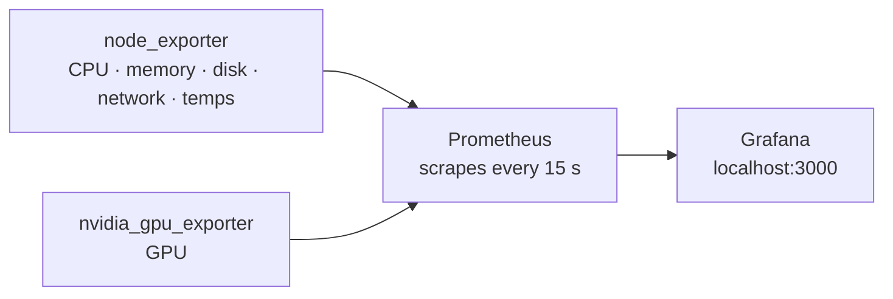

# Dashboard stack — Prometheus + Grafana

The stack behind LeSysBot's graphs. **For everyday use, read
[Dashboards](../docs/dashboards.md).** This page is the reference: how it works,
ports, configuration and files.

`lesysbot setup` copies this folder to `~/.lesysbot/dashboard` and starts it.
Everything binds to `127.0.0.1` and nothing needs `sudo`.



## Prerequisites

Docker Engine with Compose v2:

```bash
docker compose version             # should print v2.x
sudo usermod -aG docker $USER      # run Docker without sudo; log out and back in
```

Install [Docker Engine](https://docs.docker.com/engine/install/) if that fails.
Prometheus, Grafana and the exporters download themselves on first start.

## Start and stop

```bash
lesysbot dashboard start           # or ./scripts/start.sh from this folder
lesysbot dashboard stop            # or ./scripts/start.sh down
```

`start.sh` detects the GPU setup for you:

- **No NVIDIA GPU** — CPU, memory, disk and network only.
- **NVIDIA + [container toolkit](https://docs.nvidia.com/datacenter/cloud-native/container-toolkit/latest/install-guide.html)** — GPU exporter as a container.
- **NVIDIA, no toolkit** — GPU exporter runs natively instead.

All containers use the host network: it's the only way node_exporter sees the
real network interfaces, and it avoids firewall rules that block a bridge
container from reaching the host.

## The dashboard is built for your machine

`start.sh` probes the host and generates a dashboard with only the panels
something can fill — so an empty panel means a real fault, not missing hardware.

| Probed | How |
|---|---|
| CPU, disk and AMD GPU sensors | chip names in `/sys/class/hwmon/*/name` |
| ACPI thermal zones | `/sys/class/thermal/thermal_zone0` |
| NVIDIA | `nvidia-smi` on `PATH` (the exporter shells out to it) |

It also prints optional fixes, such as the `modprobe` for a missing sensor
driver. They're suggestions only, and skipped inside a VM.

The committed `system-overview.json` is the portable fallback, used when the host
has no `python3` or you run `docker compose` by hand. It includes every panel,
so some may be empty.

| Sensor | Source |
|---|---|
| CPU | `coretemp` (Intel), `k10temp` (AMD), `cpu_thermal` (ARM) |
| Disk | `nvme`, `drivetemp` |
| NVIDIA GPU | `nvidia_gpu_exporter` → `nvidia-smi` |
| AMD GPU | `amdgpu` hwmon — no exporter needed |
| ACPI, chipset, Wi-Fi | `/sys/class/thermal` zones |

## Ports

| Service | Address | Notes |
|---|---|---|
| Grafana | `127.0.0.1:3000` | login from `lesysbot setup` |
| Prometheus | `127.0.0.1:9090` | `/targets` shows exporter health |
| node_exporter | `127.0.0.1:9100` | host metrics |
| nvidia_gpu_exporter | `127.0.0.1:9835` | GPU metrics |

To reach Grafana from elsewhere, put it behind a reverse proxy with TLS. Don't
move the bind off `127.0.0.1`.

## Configuration

Edit `.env` (copied from `.env.example`; `lesysbot setup` never overwrites it):

```ini
GRAFANA_ADMIN_USER=admin
GRAFANA_ADMIN_PASSWORD=change-me
PROM_RETENTION=15d        # how long to keep data
GRAFANA_PORT=3000         # change if 3000 is taken
PROM_PORT=9090            # change if 9090 is taken
```

LeSysBot reads `GRAFANA_PORT` back, so the status screen and dashboard sharing
follow a moved Grafana with no other change.

- **Add a machine or exporter:** add its `host:port` to
  `prometheus/prometheus.yml`, then `curl -X POST http://localhost:9090/-/reload`.
- **Keep more history:** raise `PROM_RETENTION`.

## Editing the built-in dashboard

The JSON is generated — edit
[`scripts/gen-dashboards.py`](scripts/gen-dashboards.py) (stdlib only), never the
JSON:

```bash
python3 scripts/gen-dashboards.py              # the portable JSON
python3 scripts/gen-dashboards.py --host linux --have cpu_temp,disk_temp,nvidia --out FILE
```

Grafana reloads provisioned dashboards within 30 seconds. To add a separate
dashboard, make a package instead — see
[Dashboards](../docs/dashboards.md#change-or-write-one).

## Troubleshooting

| Problem | Fix |
|---|---|
| A target is `down` at `localhost:9090/targets` | Normal for exporters you don't run — e.g. `nvidia_gpu` without an NVIDIA card. |
| GPU row empty | No NVIDIA card, `nvidia-smi` missing, or no GPU exporter running. |
| No temperature row | The host exposes no sensors (normal in a VM). On bare metal, run the `modprobe` `start.sh` prints, then start again. Check with `cat /sys/class/hwmon/*/name`. |
| "address already in use" | Another program has 3000 or 9090 (VS Code often uses 9090). Change `GRAFANA_PORT` / `PROM_PORT` in `.env`. |
| Every panel empty | Prometheus isn't running — `docker compose ps` and its logs. |
| Port 9835 conflict | The containerised and native GPU exporters are both running. Use one. |

Reset everything, including stored history:

```bash
docker compose --profile gpu down -v
```

## Files

```
dashboard/
├── docker-compose.yml       the stack (host network, localhost-bound)
├── .env.example             ports, retention, Grafana login
├── prometheus/prometheus.yml   scrape config
├── grafana/
│   ├── provisioning/        datasource + dashboard auto-load
│   └── dashboards/
│       ├── system-overview.json   generated, portable
│       ├── generated-*.json       per-host cuts from start.sh (git-ignored)
│       └── generated/             rendered dashboard packages (git-ignored)
└── scripts/
    ├── start.sh             start/stop, probes the host
    ├── run-exporters.sh     native exporters (GPU fallback)
    └── gen-dashboards.py    generates the dashboard JSON
```
