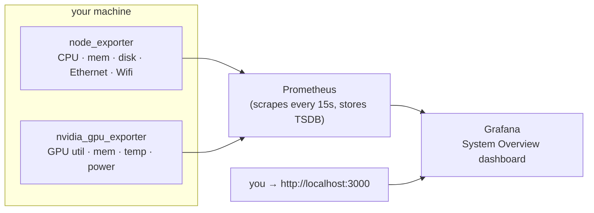

# System Overview — Prometheus + Grafana

The monitoring stack that records your machine's **CPU, memory, disk,
network (Ethernet & Wifi) and GPU** as time series and shows them on a
ready-made Grafana dashboard.

**This ships as a standard part of LeSysBot, not an add-on.** `lesysbot setup`
(run by the installer) seeds this stack into `~/.lesysbot/monitoring` and starts
it for you, so a normal install leaves Grafana running at
**http://localhost:3000**. It just needs Docker present (see below); if Docker
isn't ready at install time the setup prints the one command that finishes the
job. The steps here are for starting/stopping and reconfiguring it by hand.

It is **separate from LeSysBot itself** — it runs as its own containers, and
LeSysBot's only listener is its localhost control panel. Everything this stack
exposes is bound to **`127.0.0.1` only** (nothing on your LAN) and needs **no
sudo**.



- **Prometheus** scrapes the exporters every 15 s and stores the time series.
- **Grafana** auto-loads the datasource and the dashboard — no manual import.
- **Exporters** are the standard Prometheus ones (`node_exporter`,
  `nvidia_gpu_exporter`); nothing custom to trust.

---

## Prerequisites — install Docker (once)

The only thing you need is **Docker with Compose v2**. Check whether you already
have it:

```bash
docker compose version      # should print "Docker Compose version v2.x"
```

If that fails, install [Docker Engine](https://docs.docker.com/engine/install/)
for your distro, then add yourself to the group so you never need sudo:

```bash
sudo usermod -aG docker $USER     # then log out and back in
```

That's the whole install. Everything else below downloads automatically the
first time you start the stack — **no manual Prometheus/Grafana/exporter setup,
no config to write.**

<details>
<summary><b>Prefer not to run Docker? Install Grafana natively</b></summary>

1. **Install Grafana:** [grafana.com/grafana/download](https://grafana.com/grafana/download)
   (packages for Debian/Ubuntu, RHEL/Fedora, and a plain tarball). Start it and
   open **http://localhost:3000** (login `admin` / `admin`).
2. **Give it data.** Grafana only draws graphs — it still needs Prometheus and
   the host exporters underneath. Run `./scripts/run-exporters.sh` for the
   exporters, install Prometheus with `prometheus/prometheus.yml` as its config,
   then point Grafana at Prometheus (`http://localhost:9090`) as a data source
   and import `grafana/dashboards/system-overview.json`.
3. **Connect it to LeSysBot.** On the default port **3000**, LeSysBot finds
   Grafana automatically (the status screen links to it and the `share_dashboard`
   tool works). `lesysbot setup` asks for the Grafana **username and password** and
   saves them to `~/.lesysbot/grafana.env` (`LESYSBOT_GRAFANA_URL/_USER/_PASSWORD`),
   which LeSysBot loads at startup — set your native Grafana's admin login to
   match. If Grafana runs on another host/port, set `LESYSBOT_GRAFANA_URL` there
   (edit the file or export the variable).

The Docker stack below is still the least-effort option — it wires the data
source and dashboard up for you.

</details>

### Get the files

This stack lives in the LeSysBot repo. If you installed LeSysBot with `pip` (so
you don't have a checkout), grab it with:

```bash
git clone https://github.com/lesysbot/lesysbot
cd lesysbot/monitoring
```

The `monitoring/` folder is self-contained — copying just it is enough.

---

## Quick start

```bash
cd monitoring
./scripts/start.sh          # detects your NVIDIA GPU automatically
```

Everything (Prometheus, Grafana and the exporters) runs on the host network,
bound to localhost. Open **http://localhost:3000** — login `admin` / `admin`.

`start.sh` adapts automatically:

- **No NVIDIA GPU** → starts CPU/memory/disk/network only.
- **NVIDIA GPU + [nvidia-container-toolkit](https://docs.nvidia.com/datacenter/cloud-native/container-toolkit/latest/install-guide.html)**
  → GPU metrics run as a container (`--profile gpu`).
- **NVIDIA GPU, no toolkit** → GPU metrics run as a small **native** exporter
  instead — no toolkit needed, still works.

You don't choose; the script detects `nvidia-smi` and the Docker NVIDIA runtime
for you.

### Stop it

```bash
./scripts/start.sh down
```

---

## What you get

**One dashboard** — **System Overview** — lands in the **LeSysBot** folder in
Grafana, fed by `node_exporter` plus `nvidia_gpu_exporter`. It shows:

- **CPU** — busy %, per-mode usage, load average, core count
- **Memory** — used / cached / available, swap
- **Disk** — filesystem used % per mount, read/write throughput
- **Network** — receive/transmit **per interface**; the interface name tells
  Ethernet (`eno1`/`eth0`) from Wifi (`wlp*`/`wlan0`)
- **Temperatures** — CPU (package + per-core), disk (NVMe/SATA), GPU, and other
  sensors (ACPI zone, chipset, Wifi radio)
- **GPU (NVIDIA)** — utilization, memory used, temperature, power draw

Use the **Host** dropdown at the top to filter when more than one machine reports.

### Temperature sensor coverage

The exporters surface what the kernel exposes, and no sudo is used:

| Sensor | Source | Notes |
|---|---|---|
| **CPU** (package + cores) | `hwmon` — `coretemp` (Intel) / `k10temp` (AMD) | works out of the box |
| **Disk** (NVMe/SATA) | `hwmon` — `nvme` / `drivetemp` | SATA may need `sudo modprobe drivetemp` once; NVMe needs nothing |
| **ACPI / chipset / Wifi radio** | `thermal_zone` | `x86_pkg_temp`, `acpitz`, `iwlwifi`, … |
| **GPU** (NVIDIA) | `nvidia_gpu_exporter` | needs an NVIDIA card + driver |

Panels for sensors your hardware doesn't have simply stay empty.

---

## Share a snapshot from chat

If you also run the bot, the [`share-dashboard`](../tools/share-dashboard/) tool
turns *"share me the dashboard"* into a public link. It publishes a point-in-time
**snapshot** — the current graphs baked in as data — *through Grafana* to its
public snapshot server (`snapshots.raintank.io`), so you can send someone a
live-looking view without exposing your Grafana:

```
You:  share me the dashboard for a day
Bot:  📊 Dashboard shared — expires in 1d:
      https://snapshots.raintank.io/dashboard/snapshot/…
```

Pick an expiration (`1h`…`30d` or `never`), list your shares (*"list my shared
dashboards"* — this reads Grafana's own snapshot registry), and delete any of them
(*"delete snapshot 1"* — removed from Grafana **and** raintank). Because a snapshot
is a **public** link to a copy of your metrics, share deliberately and delete what
you no longer need. Two caveats: raintank may keep serving a *cached* copy for up
to ~1h after you delete, and a snapshot you publish from Grafana's own browser
button (rather than through the bot) can't be deleted by the tool — share through
the bot to keep it cleanable. The tool **finds Grafana automatically** (it probes
the `GRAFANA_PORT` from `.env` first, then the usual 3000/3001, and checks each
answers as Grafana), so it works even if the stack landed on 3001 because 3000 was
taken; set `LESYSBOT_GRAFANA_URL` only if Grafana runs somewhere unusual — and
even then it's verified, falling back to probing if nothing answers there. Full details: [`tools/share-dashboard/README.md`](../tools/share-dashboard/README.md).

---

## Ports & security

Everything binds to loopback; nothing is reachable from your network.

| Service | Address | Notes |
|---|---|---|
| Grafana | `127.0.0.1:3000` | login `admin` / `admin` — **change it** in `.env` |
| Prometheus | `127.0.0.1:9090` | `/targets` shows exporter health |
| node_exporter | `127.0.0.1:9100` | host metrics |
| nvidia_gpu_exporter | `127.0.0.1:9835` | GPU metrics |

**Change the Grafana password** before exposing it anywhere: copy `.env.example`
to `.env` and set `GRAFANA_ADMIN_PASSWORD`. If you deliberately publish Grafana,
put it behind a reverse proxy with TLS — don't move the bind off `127.0.0.1`
without one.

---

## Configuration

Copy `.env.example` → `.env` (git-ignored) to override:

```ini
GRAFANA_ADMIN_USER=admin
GRAFANA_ADMIN_PASSWORD=change-me
PROM_RETENTION=15d        # how long Prometheus keeps data
GRAFANA_PORT=3000         # change if 3000 is taken
PROM_PORT=9090            # change if 9090 is taken
```

`GRAFANA_PORT` is the single place the port is set: LeSysBot reads it back when it
looks for Grafana, so a stack moved to 3001 is still found by the status screen and
by *"share me the dashboard"* — no extra configuration.

- **Add another machine or exporter:** add its `host:port` to the relevant job in
  `prometheus/prometheus.yml`, then `curl -X POST http://localhost:9090/-/reload`.
- **Longer history:** raise `PROM_RETENTION` (data lives in the
  `prometheus-data` Docker volume).

---

## Editing the dashboard

`grafana/dashboards/system-overview.json` is generated — the source of truth is
[`scripts/gen-dashboards.py`](scripts/gen-dashboards.py). Change a panel there
and regenerate:

```bash
python3 scripts/gen-dashboards.py     # stdlib only, no deps
```

Grafana reloads provisioned dashboards within 30 s. You can also edit live in the
Grafana UI to experiment; re-run the generator to make a change permanent.

---

## Troubleshooting

**A target is `down` on http://localhost:9090/targets.** Normal for the ones
you're not running — `nvidia_gpu` is down without an NVIDIA card, and the native
`node` target is down when you use the containerised one (and vice-versa).

**GPU row is empty.** You have no NVIDIA card, `nvidia-smi` isn't on `PATH`, or
you started without `--profile gpu` and didn't run the native GPU exporter. Use
`./scripts/start.sh`, which picks the right path for you.

**Grafana won't start / "address already in use".** Something else holds 3000
(or 9090). Set `GRAFANA_PORT` / `PROM_PORT` in `.env` and start again.

**Metrics missing even though a native exporter is running.** Containers can't
reach a host port when `ufw`/firewall blocks the Docker bridge — that's exactly
why this stack runs on the **host network** instead. Start it with
`./scripts/start.sh` (or plain `docker compose up -d` in this folder), not a
bridge network of your own.

**Don't mix paths.** Running both the containerised GPU exporter (`--profile
gpu`) and the native one (`run-exporters.sh`) fights over port 9835. Pick one.

**Reset everything (including stored history):**
```bash
docker compose --profile gpu down -v     # -v wipes the volumes
```

---

## Files

```
monitoring/
├── docker-compose.yml            # the stack (host network, localhost-bound)
├── .env.example                  # ports, retention, Grafana login
├── prometheus/
│   └── prometheus.yml            # scrape config
├── grafana/
│   ├── provisioning/             # datasource + dashboard auto-load
│   └── dashboards/               # generated dashboard (see gen-dashboards.py)
└── scripts/
    ├── start.sh                  # one-command start/stop
    ├── run-exporters.sh          # native host exporters (no-toolkit GPU fallback)
    └── gen-dashboards.py         # regenerate the dashboard
```
