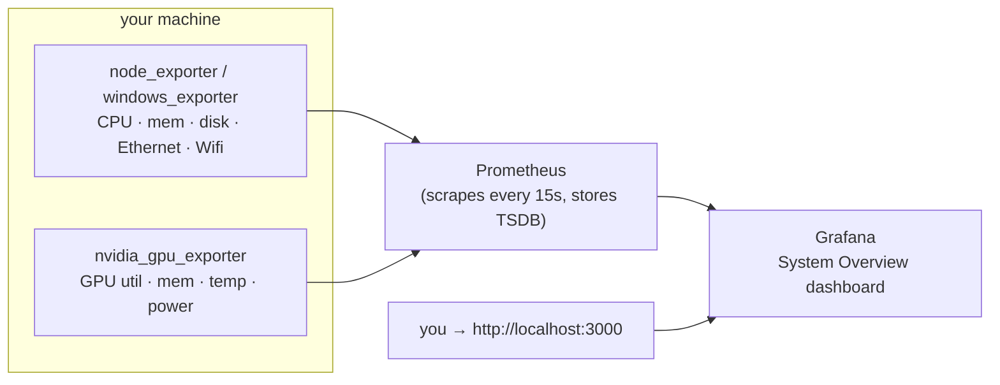

# System Overview — Prometheus + Grafana

The monitoring stack that records your machine's **CPU, memory, disk,
network (Ethernet & Wifi) and GPU** as time series and shows them on a
ready-made Grafana dashboard. Runs on **Linux, macOS and Windows**.

**This ships as a standard part of LeSysBot, not an add-on.** `lesysbot setup`
(run by the installer) seeds this stack into `~/.lesysbot/monitoring` and starts
it for you, so a normal install leaves Grafana running at
**http://localhost:3000**. It just needs Docker present (see below); if Docker
isn't ready at install time the setup prints the one command that finishes the
job. The steps here are for starting/stopping and reconfiguring it by hand.

It is **separate from LeSysBot itself** — it runs as its own containers, and
LeSysBot's only listener is its localhost control panel. Everything this stack
exposes is bound to **`127.0.0.1` only** (nothing on your LAN) and needs **no
sudo/admin**.



- **Prometheus** scrapes the exporters every 15 s and stores the time series.
- **Grafana** auto-loads the datasource and the dashboards — no manual import.
- **Exporters** are the standard Prometheus ones (`node_exporter`,
  `windows_exporter`, `nvidia_gpu_exporter`); nothing custom to trust.

---

## Prerequisites — install Docker (once)

The only thing you need is **Docker with Compose v2**. Check whether you already
have it:

```bash
docker compose version      # should print "Docker Compose version v2.x"
```

If that fails, install it — pick your OS:

| OS | Install |
|---|---|
| **Windows** | [Docker Desktop for Windows](https://docs.docker.com/desktop/install/windows-install/) — the installer includes Compose. |
| **macOS** | [Docker Desktop for Mac](https://docs.docker.com/desktop/install/mac-install/) (Intel or Apple Silicon). Or `brew install --cask docker`. |
| **Linux** | [Docker Engine](https://docs.docker.com/engine/install/) for your distro, then add yourself to the group: `sudo usermod -aG docker $USER` and log back in. Or [Docker Desktop for Linux](https://docs.docker.com/desktop/install/linux-install/). |

That's the whole install. Everything else below downloads automatically the
first time you start the stack — **no manual Prometheus/Grafana/exporter setup,
no config to write.**

<details>
<summary><b>macOS / Windows without Docker — install Grafana natively</b></summary>

`lesysbot setup` doesn't force Docker Desktop on macOS/Windows. If you'd rather
not run Docker, install Grafana as a native package instead:

1. **Install Grafana:** [grafana.com/grafana/download](https://grafana.com/grafana/download)
   (pick your OS — `.dmg`/`brew` on macOS, installer/`.zip` on Windows). Start it
   and open **http://localhost:3000** (login `admin` / `admin`).
2. **Give it data.** Grafana only draws graphs — it still needs Prometheus + the
   host exporters underneath. The easy way is the native exporters this repo ships
   plus a local Prometheus; the turnkey way is the Docker stack below. Point
   Grafana at Prometheus (`http://localhost:9090`) as a data source and import
   `grafana/dashboards/system-overview-linux-macos.json` (macOS) or
   `…-windows.json` (Windows).
3. **Connect it to LeSysBot.** On the default port **3000**, LeSysBot finds
   Grafana automatically (the status screen links to it and the `share_dashboard`
   tool works). `lesysbot setup` asks for the Grafana **username and password** and
   saves them to `~/.lesysbot/grafana.env` (`LESYSBOT_GRAFANA_URL/_USER/_PASSWORD`),
   which LeSysBot loads at startup — set your native Grafana's admin login to
   match. If Grafana runs on another host/port, set `LESYSBOT_GRAFANA_URL` there
   (edit the file or export the variable).

The Docker stack below is still the least-effort option — it wires the data
source and dashboard up for you. Native Grafana is here for people who'd rather
not install Docker Desktop.

</details>

### Get the files

This stack lives in the LeSysBot repo. If you installed LeSysBot with `pip` (so
you don't have a checkout), grab it with:

```bash
git clone https://github.com/lesysbot/lesysbot
cd lesysbot/monitoring
```

The `monitoring/` folder is self-contained — copying just it is enough.

---

## Quick start

Open a terminal in this `monitoring/` folder and run the one command for your OS.

### Linux

```bash
cd monitoring
./scripts/start.sh          # detects your NVIDIA GPU automatically
```

Everything (Prometheus, Grafana and the exporters) runs on the host network,
bound to localhost. Open **http://localhost:3000** — login `admin` / `admin`.

`start.sh` adapts automatically:

- **No NVIDIA GPU** → starts CPU/memory/disk/network only.
- **NVIDIA GPU + [nvidia-container-toolkit](https://docs.nvidia.com/datacenter/cloud-native/container-toolkit/latest/install-guide.html)**
  → GPU metrics run as a container (`--profile gpu`).
- **NVIDIA GPU, no toolkit** → GPU metrics run as a small **native** exporter
  instead — no toolkit needed, still works.

You don't choose; the script detects `nvidia-smi` and the Docker NVIDIA runtime
for you.

### macOS

```bash
cd monitoring
./scripts/start.sh          # starts native exporters, then Prometheus + Grafana
```

Open **http://localhost:3000**. (`node_exporter` runs natively because Docker
Desktop can't see the real host from inside its VM.)

### Windows (PowerShell)

```powershell
cd monitoring
.\scripts\start.ps1         # starts windows_exporter, then Prometheus + Grafana
```

Open **http://localhost:3000**. Run PowerShell **as Administrator** the first
time only if Windows blocks `windows_exporter` from binding its port.

### Stop it

```bash
./scripts/start.sh down          # Linux / macOS
.\scripts\start.ps1 down         # Windows
```

---

## What you get

**One dashboard** lands in the **LeSysBot** folder in Grafana — the one that
matches the OS you started (the start script/compose file provisions only that
one, so you never see an empty dashboard for another OS):

| You started on… | Dashboard provisioned | Source |
|---|---|---|
| **Linux** or **macOS** | **System Overview — Linux / macOS** | `node_exporter` |
| **Windows** | **System Overview — Windows** | `windows_exporter` |

> Running the bridge compose by hand on Windows (`docker compose up -d` instead
> of `start.ps1`)? Set `DASH_JSON=system-overview-windows.json` first, or just use
> `start.ps1`. Both dashboard files always exist under `grafana/dashboards/`;
> only the selected one is mounted into Grafana.

It shows these categories:

- **CPU** — busy %, per-mode usage, load average, core count
- **Memory** — used / cached / available, swap (or commit on Windows)
- **Disk** — filesystem used % per mount, read/write throughput
- **Network** — receive/transmit **per interface**; the interface name tells
  Ethernet from Wifi (`eno1`/`eth0` vs `wlp*`/`wlan0` on Linux, `en0` vs `en1`
  on macOS, the adapter name on Windows)
- **Temperatures** — CPU (package + per-core), disk (NVMe/SATA), GPU, and other
  sensors (ACPI zone, chipset, Wifi radio). See the caveats below.
- **GPU (NVIDIA)** — utilization, memory used, temperature, power draw

Use the **Host** dropdown at the top to filter when more than one machine reports.

The dashboard **adapts to the OS**: the CPU, memory, disk-usage and network
panels use metric names that work on both Linux and macOS (memory falls back to
macOS's `active`/`wired`/`compressed` counters automatically). A few readings are
Linux-only where macOS doesn't expose them — **swap**, **disk I/O throughput**,
and most **temperatures** (see below); those panels simply stay empty on macOS.

### Temperature sensor coverage

What's available depends on the OS — the exporters only surface what the kernel
exposes, and no sudo is used:

| Sensor | Linux | macOS | Windows |
|---|---|---|---|
| **GPU** (NVIDIA) | ✅ | ✅ | ✅ |
| **CPU** (package + cores) | ✅ `coretemp`/`k10temp` | ❌ | ⚠️ only if ACPI reports it |
| **Disk** (NVMe/SATA) | ✅ `nvme`/`drivetemp` | ❌ | ❌ |
| **ACPI / chipset / Wifi radio** | ✅ thermal zones | ❌ | ⚠️ ACPI thermal zone, often empty on desktops |

- **Linux** gives the fullest picture — CPU, disk and chassis/Wifi sensors all
  come through `node_exporter`'s `hwmon`/`thermal_zone` collectors (a
  `drivetemp` disk reading may need `sudo modprobe drivetemp` once; NVMe needs
  nothing). Panels for sensors your hardware doesn't have simply stay empty.
- **macOS** exposes no component temps through `node_exporter` (only GPU, via
  `nvidia-smi`, which most Macs don't have). Those panels stay empty.
- **Windows** shows ACPI thermal-zone temps when the firmware provides them
  (common on laptops, rare on desktops). Per-component CPU/disk temps need a
  helper like **LibreHardwareMonitor** — not bundled here.

---

## Share a snapshot from chat

If you also run the bot, the [`share-dashboard`](../tools/share-dashboard/) tool
turns *"share me the dashboard"* into a public link. It publishes a point-in-time
**snapshot** — the current graphs baked in as data — *through Grafana* to its
public snapshot server (`snapshots.raintank.io`), so you can send someone a
live-looking view without exposing your Grafana:

```
You:  share me the dashboard for a day
Bot:  📊 Dashboard shared — expires in 1d:
      https://snapshots.raintank.io/dashboard/snapshot/…
```

Pick an expiration (`1h`…`30d` or `never`), list your shares (*"list my shared
dashboards"* — this reads Grafana's own snapshot registry), and delete any of them
(*"delete snapshot 1"* — removed from Grafana **and** raintank). Because a snapshot
is a **public** link to a copy of your metrics, share deliberately and delete what
you no longer need. Two caveats: raintank may keep serving a *cached* copy for up
to ~1h after you delete, and a snapshot you publish from Grafana's own browser
button (rather than through the bot) can't be deleted by the tool — share through
the bot to keep it cleanable. The tool **finds Grafana automatically** (it probes
the `GRAFANA_PORT` from `.env` first, then the usual 3000/3001, and checks each
answers as Grafana), so it works even if the stack landed on 3001 because 3000 was
taken; set `LESYSBOT_GRAFANA_URL` only if Grafana runs somewhere unusual — and
even then it's verified, falling back to probing if nothing answers there. Full details: [`tools/share-dashboard/README.md`](../tools/share-dashboard/README.md).

---

## Ports & security

Everything binds to loopback; nothing is reachable from your network.

| Service | Address | Notes |
|---|---|---|
| Grafana | `127.0.0.1:3000` | login `admin` / `admin` — **change it** in `.env` |
| Prometheus | `127.0.0.1:9090` | `/targets` shows exporter health |
| node / windows exporter | `127.0.0.1:9100` / `:9182` | host metrics |
| nvidia_gpu_exporter | `127.0.0.1:9835` | GPU metrics |

**Change the Grafana password** before exposing it anywhere: copy `.env.example`
to `.env` and set `GRAFANA_ADMIN_PASSWORD`. If you deliberately publish Grafana,
put it behind a reverse proxy with TLS — don't move the bind off `127.0.0.1`
without one.

---

## Configuration

Copy `.env.example` → `.env` (git-ignored) to override:

```ini
GRAFANA_ADMIN_USER=admin
GRAFANA_ADMIN_PASSWORD=change-me
PROM_RETENTION=15d        # how long Prometheus keeps data
GRAFANA_PORT=3000         # change if 3000 is taken
PROM_PORT=9090            # change if 9090 is taken
```

`GRAFANA_PORT` is the single place the port is set: LeSysBot reads it back when it
looks for Grafana, so a stack moved to 3001 is still found by the status screen and
by *"share me the dashboard"* — no extra configuration.

- **Add another machine or exporter:** add its `host:port` to the relevant job in
  `prometheus/prometheus.yml` (macOS/Windows) or `prometheus/prometheus.linux.yml`
  (Linux), then `curl -X POST http://localhost:9090/-/reload`.
- **Longer history:** raise `PROM_RETENTION` (data lives in the
  `prometheus-data` Docker volume).

---

## Editing the dashboards

The two JSON files under `grafana/dashboards/` are generated — the source of
truth is [`scripts/gen-dashboards.py`](scripts/gen-dashboards.py). Change a panel
there and regenerate so both dashboards stay consistent:

```bash
python3 scripts/gen-dashboards.py     # stdlib only, no deps
```

Grafana reloads provisioned dashboards within 30 s. You can also edit live in the
Grafana UI to experiment; re-run the generator to make a change permanent.

---

## Troubleshooting

**A target is `down` on http://localhost:9090/targets.** That's normal for the
ones you're not running — `windows` is down on Linux/macOS, `nvidia_gpu` is down
without an NVIDIA card, and the native `node` target is down when you use the
containerised one (and vice-versa). Only the exporter for *your* OS needs to be
`up`.

**GPU row is empty.** You have no NVIDIA card, or `nvidia-smi` isn't on `PATH`,
or (Linux) you started without `--profile gpu` and didn't run the native GPU
exporter. On Linux without the nvidia-container-toolkit, use the native fallback
shown in *Quick start → Linux*.

**Grafana won't start / "address already in use".** Something else holds 3000
(or 9090). Set `GRAFANA_PORT` / `PROM_PORT` in `.env` and start again.

**Linux: metrics missing even though a native exporter is running.** Containers
can't reach a host port when `ufw`/firewall blocks the Docker bridge — that's
exactly why the Linux stack runs on the **host network** instead. Use
`./scripts/start.sh` (or `docker-compose.linux.yml`), not the bridge
`docker-compose.yml`.

**Don't mix paths.** Running both the containerised GPU exporter (`--profile
gpu`) and the native one (`run-exporters.sh`) fights over port 9835. Pick one.

**Reset everything (including stored history):**
```bash
docker compose -f docker-compose.linux.yml --profile gpu down -v   # Linux (-v wipes volumes)
docker compose down -v                                             # macOS/Windows
```

---

## Files

```
monitoring/
├── docker-compose.yml            # macOS / Windows stack (bridge + host.docker.internal)
├── docker-compose.linux.yml      # Linux stack (host network, localhost-bound)
├── .env.example                  # ports, retention, Grafana login
├── prometheus/
│   ├── prometheus.yml            # scrape config — macOS / Windows
│   └── prometheus.linux.yml      # scrape config — Linux
├── grafana/
│   ├── provisioning/             # datasource + dashboard auto-load
│   └── dashboards/*.json         # generated dashboards (see gen-dashboards.py)
└── scripts/
    ├── start.sh / start.ps1      # one-command start/stop, OS-aware
    ├── run-exporters.sh / .ps1   # native host exporters (macOS / Windows / Linux fallback)
    └── gen-dashboards.py         # regenerate the dashboards
```
